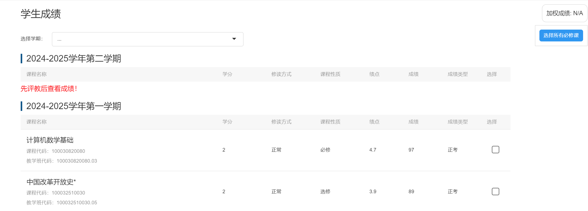
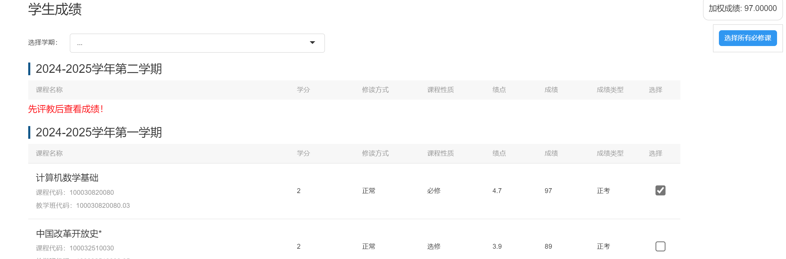

# DLUT_GPA_Helper

大工加权助手是一个为大连理工大学学生设计的浏览器插件，用于帮助学生更灵活地计算加权成绩。

## 功能特点

- ✅ **自定义选择课程**：为成绩表格添加复选框，可手动选择需要计算的课程
- 🔄 **实时计算**：选中/取消课程后自动更新加权成绩
- 🏆 **必修课快速选择**：一键选择所有必修课程
- 📊 **浮动显示结果**：计算结果显示在浮动窗口中，方便查看
- 📱 **响应式界面**：适配桌面综合教学管理系统

## 安装方法

1. 首先安装脚本管理器扩展：
   - **Chrome/Edge**：安装 [Tampermonkey](https://www.tampermonkey.net/)
   - **Firefox**：安装 [Greasemonkey](https://addons.mozilla.org/zh-CN/firefox/addon/greasemonkey/)
2. 复制 `DLUT_GPA_Helper.js` 文件，通过新建脚本粘贴到脚本管理器中
3. 登陆综合教学管理系统使用

请注意：**当复选框没有显示出来的时候请刷新界面**

请注意：本项目为**纯前端项目**，**不会获取**用户**任何**个人信息

#### 许可证

本项目采用 MIT 许可证 - 详情请参阅 LICENSE 文件
